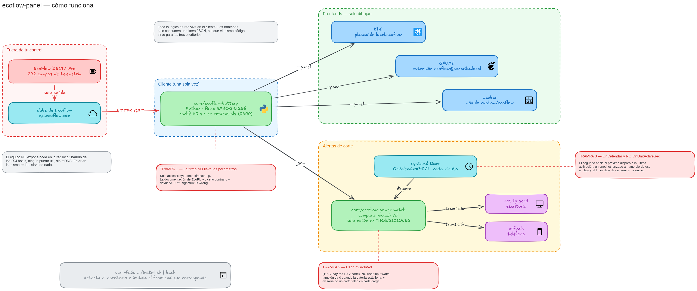

# ecoflow-panel

Your EcoFlow power station's charge in the desktop panel, and a push to your
phone the moment mains power drops.

One client, three desktops: **KDE Plasma**, **GNOME Shell**, **waybar**.

```
☁ 97%          ← in the panel, always visible, nothing to open
```

## Install

```bash
curl -fsSL https://raw.githubusercontent.com/danielbanariba/ecoflow-panel/main/install.sh | bash
```

It checks prerequisites, installs the client, **detects your desktop and
installs the matching frontend**, and enables the outage timer. Re-running is
safe — every step is idempotent.

First run stops to ask for API keys. Get them at
[developer.ecoflow.com](https://developer.ecoflow.com) → *Security Information
Management* → **Create AccessKey**, put them in
`~/.config/ecoflow/credentials`, and run the installer again. It finds your
device serial by itself.

```bash
./install.sh --uninstall          # remove everything
./install.sh --frontend gnome     # override the detection
./install.sh --no-watch           # skip the outage alerts
```

## What it does

| | |
|---|---|
| `ecoflow-battery` | charge, from the cloud API. `--json` gives all 242 fields |
| `ecoflow-power-watch` | notices the grid dropping and pushes to your phone |
| KDE / GNOME / waybar | a panel item that reads the same one-line JSON |

```bash
ecoflow-battery                 # 97%
ecoflow-battery --panel         # {"soc":97,"state":"idle","watts":0,"minutes":null}
ecoflow-battery --json          # everything the unit reports
ecoflow-power-watch --status    # red: presente  115.2 V  entrada 244 W  bateria 97%
```

## How it works



*The source is `docs/architecture.excalidraw` — open it at
[excalidraw.com](https://excalidraw.com) to edit.*

Every desktop frontend runs the same client and reads the same JSON line. The
credentials, the HMAC signing, the cache and the field selection live in one
Python file that you can run from a shell — so a frontend is a hundred lines of
drawing code and nothing else.

## Three things that cost real time

**The signature does not include the request parameters.** EcoFlow's own
documentation says to sort the params, join them with `&`, append `accessKey`,
`nonce` and `timestamp`, and sign the lot. Do that and `/device/quota/all`
answers `8521 signature is wrong`. Sign only the three credentials, put `sn` in
the URL, and it returns all 242 fields. `/device/list` takes no parameters, so
it signs correctly either way — which is exactly why the first call looks fine
and hides the problem until the second one.

**Read `inv.acInVol`, not `inputWatts`, to detect an outage.** Input watts also
falls to zero when the pack is simply full and has stopped drawing, so a watts-
based check announces a blackout every time charging completes. The AC input
voltage only reaches zero when the wall really is dead.

**Use `OnCalendar`, not `OnUnitActiveSec`, for the timer.** `OnUnitActiveSec`
anchors the next run to the unit's last activation; a oneshot service that is
also started by hand loses that anchor, and the timer then reports itself as
`active (waiting)` while `systemctl list-timers` shows an empty `NEXT` and
nothing ever fires again. The detector was correct for eleven minutes while the
schedule had silently stopped.

## There is no local path

The unit answers nothing on your LAN. A sweep of all 254 hosts turns up one
device that accepts a TCP connection on port 80 and then returns an empty reply
— not HTTP, not an API — and nothing advertises over mDNS. Its WiFi exists to
reach EcoFlow's cloud outbound. **Being on the same network buys nothing**: the
reading goes out to the internet and comes back, even with the unit in the same
room.

Which has a consequence worth planning around: if mains power drops, the alert
is sent **by your machine**. The PC and the router both have to be running off
the pack, or nothing gets sent.

## Requirements

- Python 3.8+, `curl`
- An account on the EcoFlow IoT Developer Platform
- `notify-send` for desktop alerts (optional)
- For phone pushes: the [ntfy](https://ntfy.sh) app, subscribed to your topic

## Credentials

`~/.config/ecoflow/credentials`, mode `0600`, gitignored.

These keys grant **control** of the unit, not just reads — the same API turns
outputs on and off. Treat them as a password. If one leaks, delete it on the
platform: creating a new key does **not** revoke the old one, they coexist until
you remove it explicitly.

## Licence

MIT
